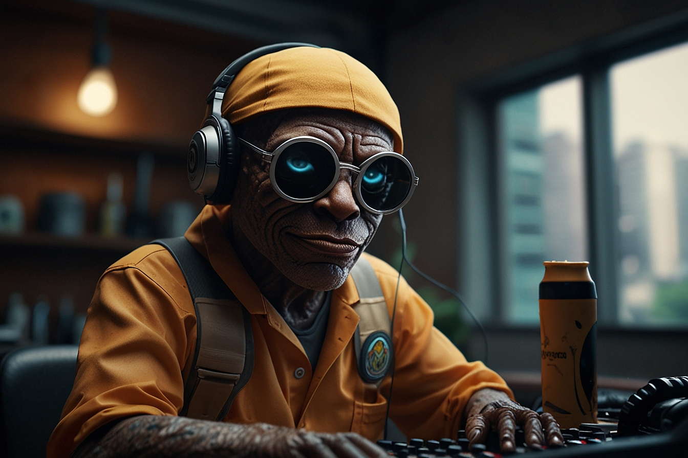

  

  
  

  Preview do Podcast

  <audio src="output/podcast_editado.MP3" controls title="Podcast editado"></audio>

# Projeto Podcast Gerado por I.A.s

> ℹ️ **NOTA:** Este é o repositório desenvolvido durante uma live no Youtube em parceria com a [DIO](https://dio.me)

Projeto com o objetivo de gerar um podcast utilizando ferramentas de IA através de prompts mais trabalhados.

Utilizamos uma esteira de prompts para gerar cada etapa do processo criativo.

## 💻 Tecnologias utilizadas no projeto

- [ChatGPT](https://chat.openai.com/) 
- [Leonardo.AI](https://app.leonardo.ai/ai-generations)
- [ElevenLabs](https://beta.elevenlabs.io/)

## ✨ Como foi feito?

- Roteiro gerado via ChatGPT
- Áudio gerado pela ElevenLabs
- Leonardo.Ai para gerar capas

## 📚 Materiais

- [Notion Template](https://www.notion.so/PAS-Podcast-AI-Studio-2134944ef15249f2883187b2df26fd37)

## 🛠️ Instruções de execução

Utilize os prompts dentro do link do Notion fornecido na parte de Materiais para criar um podcast de maneira automatizada. Siga o passo a passo abaixo:

- 🤖 1. Use os prompts de roteiro no ChatGPT
- 🤖 2. Use os prompts de roteiro gerados pelo ChatGPT no ElevenLabs
- 🤖 3. Use os prompts de artes no Leonardo.Ai

## 👨‍💻 Contato

- Marcos Barbosa
  - [GitHub](https://github.com/marcsalexandrborges/prompts-for-podcast-generate-by-ia)
  - [LinkedIn](https://www.linkedin.com/in/marcos-barbosa-0a95b346/)
  

---

⌨️ com 💜 por [Marcos Barbosa](https://github.com/marcsalexandrborges/prompts-for-podcast-generate-by-ia)
